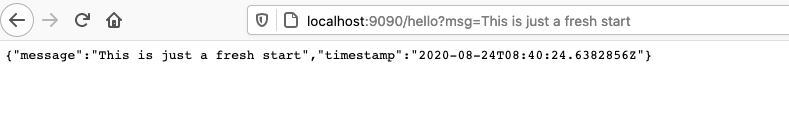
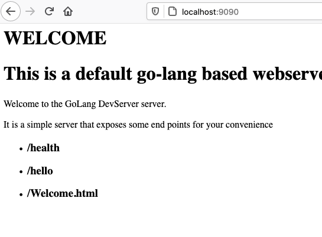

# Project Probe
In this project I will try to create a simple HTTP endpoint that will be hosted as a service that can respond to end points
- /hello
  
  Hello can take an argument `msg` which if specified can return the desired output.
  
  

- /check
- / 
  
  
I will be using this for livenessProbe example, and is open for extension for anyone wanting to extend this application.

## Docker build

### Build the image

```bash
docker build -t samarthya/epserver:1.0 .
```

### Run the docker image

```bash
docker run --name epserver -p 9090:8090 samarthya/epserver:1.0 
```

### Optional signed image

```bash
docker trust sign samarthya/epserver:1.0
```

## /hello
Hello end point will return a response as under

```json
{
    "message": "Hello",
    "stamp": "timestamp"
}
```

## /check
Will add details later TBD

# References
I am using the [image](https://hub.docker.com/_/golang)

## Pending Items
- Unit testing files.

## Additions
I am adding some Kubernetes file as I learn more about each individual resource and will soon add a helm chart for the same too.

### Helm
I will add a repository as my local git repo, which can server the index.yaml

```
https://github.com/samarthya/hlmepserver.git
```